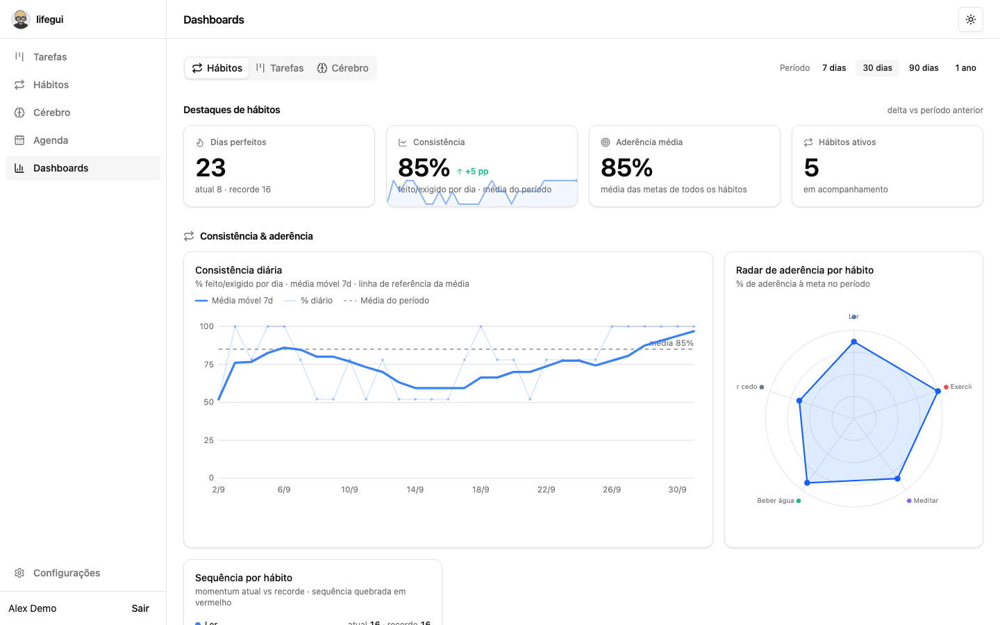
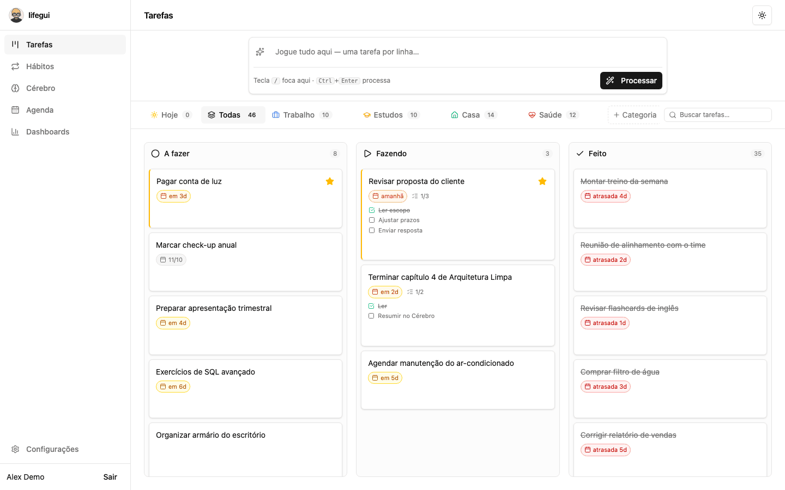
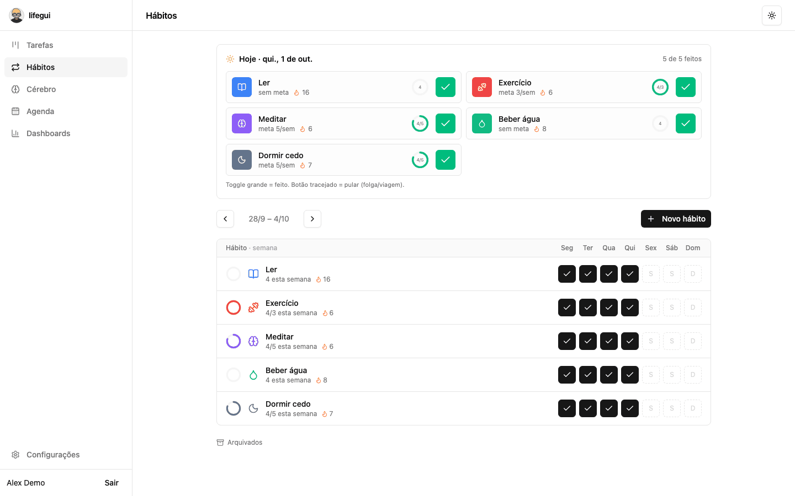
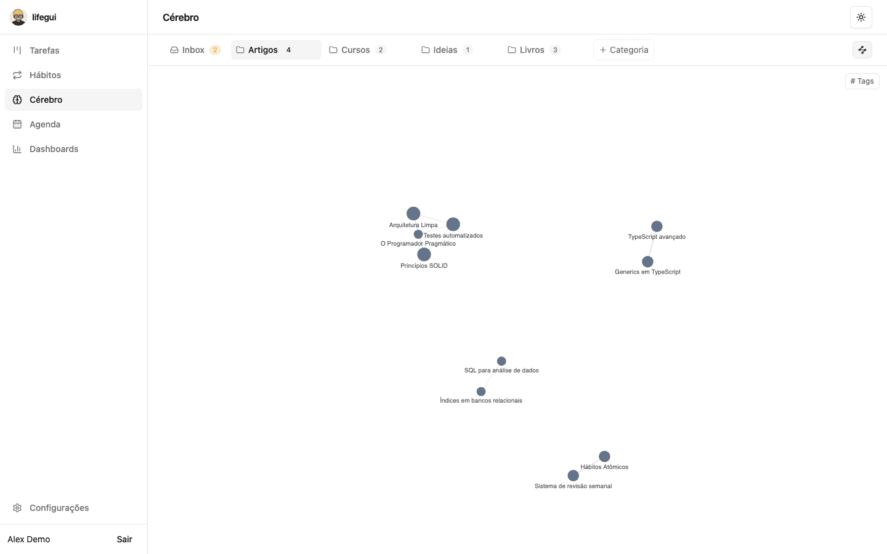
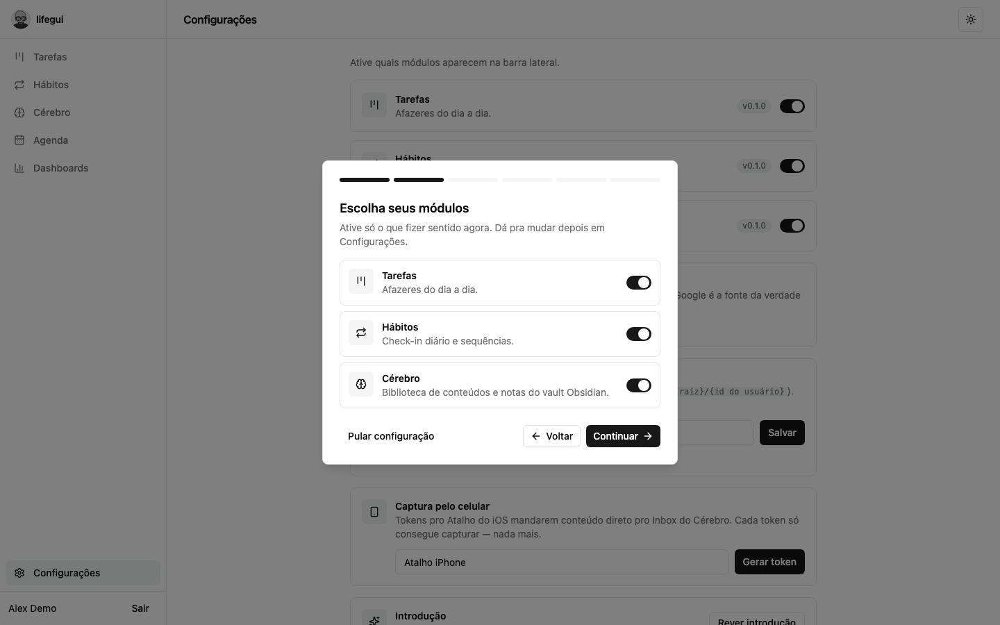

# lifegui

**Self-hosted personal organizer: tasks, habits, an Obsidian-compatible second brain and your Google Calendar in one place. Talk to it from Claude or ChatGPT through MCP.**



> The interface is available in English and Brazilian Portuguese. Each user picks a language in Settings.

**Documentation:** [docs-lifegui.hengen.com.br](https://docs-lifegui.hengen.com.br) (English and Brazilian Portuguese). Source in [tabomgui/lifegui-docs](https://github.com/tabomgui/lifegui-docs).

## Quick start

On Linux or macOS with Docker:

```bash
curl -fsSL https://raw.githubusercontent.com/tabomgui/lifegui/main/install.sh | bash
```

The installer asks for the URL you will use to open lifegui (default `http://localhost:8080`). To skip the questions:

```bash
curl -fsSL https://raw.githubusercontent.com/tabomgui/lifegui/main/install.sh \
  | LIFEGUI_URL=https://life.example.com LIFEGUI_PORT=8080 bash
```

Then open the URL, create your account on the setup screen and follow the first-run wizard. Create the account right away: until the first account exists, anyone who can reach the URL can claim the instance, so finish setup before exposing it publicly.

**Windows:** install [WSL2](https://learn.microsoft.com/windows/wsl/install) and Docker Desktop with the WSL2 backend, then run the command in your WSL2 terminal.

What the installer does:

- Checks for git, curl, openssl and Docker with Compose v2, and offers to install Docker on Linux.
- Clones this repository into `~/lifegui`, or updates it if it is already there.
- Writes `.env` and `backend/.env` with a random database password and app key. It never overwrites existing files.
- Builds the images locally and starts MySQL, the Laravel API and the nginx web server with Docker Compose.
- Waits until the app answers and prints the URL.

## Features

- **Tasks**: kanban per category with due dates, priorities, subtasks and drag and drop.
- **Habits**: weekly targets, daily check-ins, streaks and consistency heatmaps.
- **Brain**: Markdown notes stored as plain files in an Obsidian-compatible vault on your server. Quick-capture inbox, tags, wikilinks, backlinks, graph view and a WYSIWYG editor.
- **Calendar**: Google Calendar as the source of truth. Schedule tasks, habits and notes, and edit a single occurrence or the whole series.
- **Dashboards**: one per area, with heatmaps, an adherence radar and the weekly flow.
- **MCP server**: an OAuth 2.1 endpoint at `/mcp` that lets Claude (web, mobile, Claude Code) and ChatGPT read your day and create tasks, captures and events.
- **Multi-user**: each user has isolated data and their own vault. Each user turns modules on and off.

## Screenshots

| Tasks | Habits |
| --- | --- |
|  |  |
| **Brain** | **First-run wizard** |
|  |  |

## Configuration

Installer variables:

| Variable | Default | Description |
| --- | --- | --- |
| `LIFEGUI_URL` | asked, `http://localhost:8080` | Public URL. Setting it skips all questions. |
| `LIFEGUI_PORT` | the URL port on localhost, otherwise `8080` | Host port published by the web container. |
| `LIFEGUI_DIR` | `~/lifegui` | Installation directory. |
| `LIFEGUI_REF` | `main` | Branch or tag to install. |

App settings live in `backend/.env` inside the installation directory. After you edit it, restart the backend:

```bash
cd ~/lifegui && docker compose -f docker-compose.prod.yml restart backend
```

| Key | Default | Description |
| --- | --- | --- |
| `APP_URL`, `FRONTEND_URL` | your URL | Must match the address in the browser. |
| `SESSION_DOMAIN` | host of your URL | Cookie domain. |
| `SANCTUM_STATEFUL_DOMAINS` | `host[:port]` of your URL | Host the SPA runs on. |
| `SESSION_SECURE_COOKIE` | `true` for https URLs | Sends cookies only over HTTPS. |
| `REGISTRATION_ENABLED` | `false` | Allows new sign-ups after the first account. |
| `VAULTS_PATH` | `/vaults` | Root folder for the Brain vaults inside the container (one subfolder per user). Applies to the whole instance; only the server administrator can change it, not the UI. The host folder is set by `VAULTS_PATH_HOST` in `.env`. |
| `GOOGLE_CLIENT_ID`, `GOOGLE_CLIENT_SECRET` | empty | Enable Google sign-in and Calendar. |

To change the URL later, update `APP_URL`, `FRONTEND_URL`, `SESSION_DOMAIN`, `SANCTUM_STATEFUL_DOMAINS`, `SESSION_SECURE_COOKIE` and `GOOGLE_REDIRECT_URI`, then restart the backend.

## HTTPS and reverse proxy

`http://localhost` works out of the box. You need HTTPS when:

- you open lifegui from other devices, otherwise passwords travel in clear text;
- you use Google sign-in or Calendar, because Google only accepts `https` redirect URIs (localhost is the exception);
- you connect claude.ai or ChatGPT through MCP, because they require a public `https` URL.

Put a TLS-terminating proxy in front of the web container and give the installer the `https://` URL.

**Cloudflare Tunnel:** point a public hostname to `http://localhost:8080`.

**Tailscale:** `tailscale serve --bg 8080` publishes `https://<machine>.<tailnet>.ts.net` inside your tailnet. MCP from claude.ai needs public access: use `tailscale funnel --bg 8080`.

**Caddy:**

```
life.example.com {
    reverse_proxy localhost:8080
}
```

The proxy must send `X-Forwarded-Proto`. Cloudflare, Tailscale and Caddy do it by default.

## Optional integrations

### Google Calendar

Google sign-in and Calendar share one OAuth client.

1. Create a project in the [Google Cloud console](https://console.cloud.google.com/).
2. Enable the **Google Calendar API** in APIs & Services > Library.
3. Configure the **OAuth consent screen** as External. While the app is in testing mode, add your Google account as a test user.
4. Create an **OAuth client ID** of type **Web application** with these authorized redirect URIs:
   - `https://life.example.com/api/auth/google/callback`
   - `https://life.example.com/api/auth/google-calendar/callback`
5. Put the client ID and secret in `backend/.env`:

   ```
   GOOGLE_CLIENT_ID=...
   GOOGLE_CLIENT_SECRET=...
   ```

6. Restart the backend and connect the calendar in **Configurações** (Settings).

Connect the calendar with the same Google account email that you use to sign in to lifegui.

### MCP (Claude and ChatGPT)

The MCP endpoint is `https://life.example.com/mcp`. Clients sign in with your lifegui account through OAuth, so there are no tokens to copy.

- **claude.ai:** add a custom connector with the endpoint URL.
- **Claude Code:** `claude mcp add --transport http lifegui https://life.example.com/mcp`
- **ChatGPT:** in developer mode, create a connector with the endpoint URL.

Tools: `my_day`, `my_studies`, `search_notes`, `capture`, `create_task`, `complete_habit` and `schedule`. Answers follow your language setting.

## Updating

Run the installer again, either the one-liner or `./install.sh` from inside the installation directory. It pulls the latest code, keeps your configuration, rebuilds the images and restarts the containers. Database migrations run on startup.

```bash
curl -fsSL https://raw.githubusercontent.com/tabomgui/lifegui/main/install.sh | bash
```

## Backup and restore

Back up the database, the vaults, the MCP OAuth keys and the configuration. Use `sudo` for the `tar` step because `oauth-keys/` is owned by root (created inside the container by `php artisan passport:keys`):

```bash
cd ~/lifegui
docker compose -f docker-compose.prod.yml exec -T mysql \
  sh -c 'mysqldump -uroot -p"$MYSQL_ROOT_PASSWORD" lifegui' > lifegui.sql
sudo tar czf lifegui-backup.tgz lifegui.sql vaults oauth-keys .env backend/.env
```

To restore on a new machine, extract the backup in a fresh clone before you start anything (again with `sudo`, so the restored files keep their original ownership):

```bash
git clone https://github.com/tabomgui/lifegui.git ~/lifegui && cd ~/lifegui
sudo tar xzf /path/to/lifegui-backup.tgz
docker compose -f docker-compose.prod.yml up -d --wait mysql
docker compose -f docker-compose.prod.yml exec -T mysql \
  sh -c 'mysql -uroot -p"$MYSQL_ROOT_PASSWORD" lifegui' < lifegui.sql
docker compose -f docker-compose.prod.yml up -d --build
```

## Uninstall

This deletes all data, including the database volume:

```bash
cd ~/lifegui
docker compose -f docker-compose.prod.yml down -v --rmi local
cd ~ && rm -rf ~/lifegui
```

## Development

```bash
git clone https://github.com/tabomgui/lifegui.git && cd lifegui
cp backend/.env.example backend/.env
docker compose up
```

- Frontend with hot reload: http://localhost:5173
- API: http://localhost:8000

The backend container installs dependencies, generates `APP_KEY` and runs the migrations. Sign-up is open in development (`REGISTRATION_ENABLED=true` in `backend/.env.example`).

Demo data (user `demo@lifegui.test`, password `demo1234`):

```bash
docker compose exec backend php artisan db:seed --class=DemoSeeder
```

Tests:

```bash
cd backend && php artisan test   # Pest
cd frontend && npm run build     # typecheck and build
```

## Tech stack

| Layer | Technology |
| --- | --- |
| Backend | Laravel 12 (PHP 8.4), MySQL 8, Sanctum (SPA), Passport and laravel/mcp (MCP), Pest |
| Frontend | React 19, Vite, TypeScript, Tailwind CSS v4, shadcn/ui, TanStack Query, FullCalendar, Milkdown, lucide-react |
| Infra | Docker Compose. nginx serves the SPA and proxies `/api`, `/sanctum`, `/mcp`, `/oauth` and `/.well-known` to the API. |

Every domain model is scoped to the signed-in user, and each user gets an Obsidian vault at `vaults/{user_id}` on the host.

```
backend/    Laravel API (domain logic in app/Support: Calendar, Vault, Reports)
frontend/   React SPA (pages, components per module, TanStack Query hooks)
install.sh  One-command installer and updater
```

## License

[AGPL-3.0](LICENSE)
